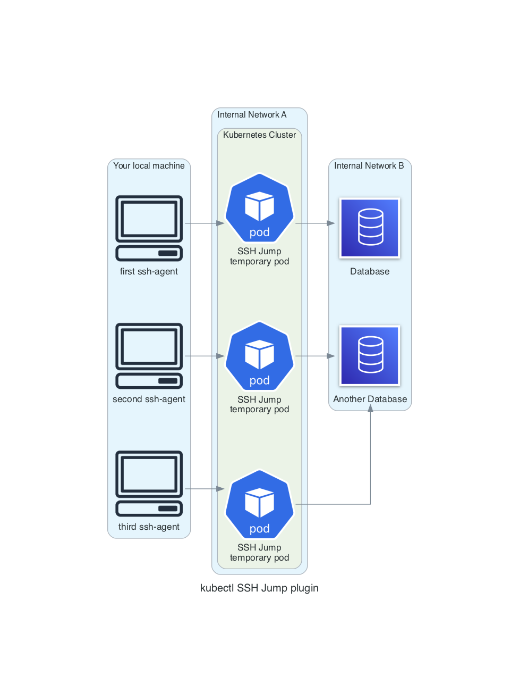

# kubectl-plugin-ssh-jump

[](https://github.com/topics/kubectl-plugin)

*It is a fork of [yokawasa/kubectl-plugin-ssh-jump](https://github.com/yokawasa/kubectl-plugin-ssh-jump). I had some ideas how can I improve this plugin, thus the fork. Currently, there is only a manual installation, but maybe I will add this plugin to krew. I do not know yet.*

A kubectl plugin to SSH into any machine within a network using a SSH jump host Pod.

A `jump host` Pod is an intermediary Pod through which a connection can be made to any machine within a network.

Here is an scenario where you want to connect to a machine, but you have to go through a jump host Pod, because of firewalling, access privileges. etc. There is a number of valid reasons why the jump hosts are needed.



## Pre-requistes
This plugin needs the following programs:
* ssh (>=8.5)
* ssh-agent
* ssh-keygen

## Installation

```sh
# Get source
$ git clone https://github.com/tomislater/kubectl-plugin-ssh-jump.git
$ cd kubectl-plugin-ssh-jump
$ chmod +x kubectl-ssh-jump
# Add kubeclt-ssh-jump to the install path.
$ sudo cp -p kubectl-ssh-jump /usr/local/bin/kubectl-ssh_jump
```

Then, run:
```sh
$ kubectl plugin list

The following kubectl-compatible plugins are available:
/usr/local/bin/kubectl-ssh_jump

$ kubectl ssh-jump
```

## How to use

```TXT
Options:
  <dest_node>                                 Destination node name or IP address with user name
  -i, --identity <identity_file>              Identity key file, or PEM(Privacy Enhanced Mail)
  -c, --context <context_name>                You can user other context
  --image <image>                             Your custom image
  -P, --port <port>                           SSH port for target node SSH server (default:22)
  --port-forward <local_port>:<remote_port>   If you just want to enable port forwarding
  --port-forward-bind-address <address>       Address to bind (optional, default:127.0.0.1)
  -a, --args <args>                           Args to exec in ssh session
  -h, --help                                  Show this message

Example:
  $ kubectl ssh-jump -i ~/.ssh/mykey.pem admin@rabbit.internal.prod
  $ kubectl ssh-jump -i ~/.ssh/mykey.pem --context prod admin@rabbit.internal.prod

Port forward example:
  $ kubectl ssh-jump -i ~/.ssh/mykey.pem --port-forward 37017:27017 admin@mongo.internal.prod
```

## Useful Links

- [Extend kubectl with plugins](https://kubernetes.io/docs/tasks/extend-kubectl/kubectl-plugins/)
- [Write your own kubectl subcommands](https://ahmet.im/blog/kubectl-plugins/)
- [SSH-AGENT - SINGLE SIGN-ON USING SSH](https://www.ssh.com/ssh/agent)

## Contributing

Bug reports and pull requests are welcome on GitHub at https://github.com/tomislater/kubectl-plugin-ssh-jump
